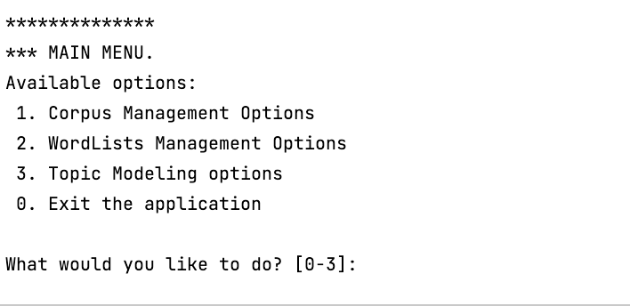
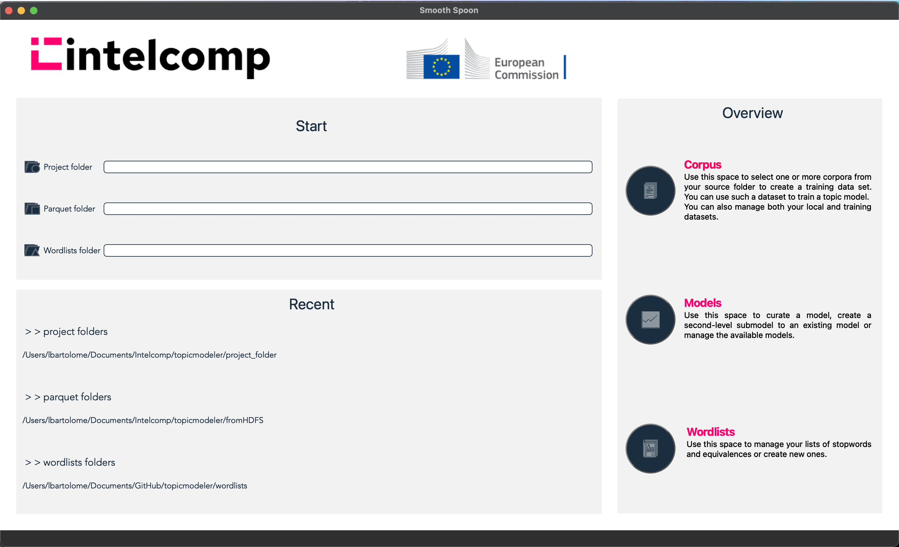

# topicmodeler

[](https://github.com/IntelCompH2020/topicmodeler/blob/main/LICENSE)


This repository contains a collection of Topic Modeling tools developed for the IntelComp H2020 project. The toolbox is built in Python and includes both a command-line interface and a PyQT6-based graphical user interface for training topic models using an expert-in-the-loop approach. It offers tools for preprocessing operations (e.g., ad-hoc stopwords removal, equivalences substitution), training topic models using state-of-the-art implementations, and curating topic models.

## Getting Started

To start using the application, execute the following command:

```bash
python main_script --p project_folder --parquet parquet_folder --wdlist wordlists_folder
```

- `main_script`: Refers to the script for the desired application version:
  - Use `ITMT_mainCMD.py` for the command-line interface.
  - Use `ITMT_mainGUI.py` for the graphical user interface.

- `project_folder`: Path to a new or existing project where the application's output will be saved.
  
- `parquet_folder`: Path to the downloaded parquet datasets.

- `wordlists_folder`: Path to the folder containing wordlists.

For the graphical user interface, you can also invoke the application without parameters:

```bash
python ITMT_mainGUI.py
```

In this case, you can select the required parameters from the application's front page.

## User Interfaces

### Command Line User Interface

The command-line user interface is menu-based. Users can navigate the application by entering the number associated with each functionality. When input is required, the user will be prompted accordingly.



As the user interacts with the application, new options will be presented. The logic of operation for the console-based interface is defined in the configuration file located at `/config/ITMTmenu.yaml`.

### Graphical User Interface

The graphical user interface comprises four main subwindows, each corresponding to a distinct functionality of the application, along with an additional subwindow for the welcome page. These subwindows are accessible via buttons on the left menu.



## Docker Integration

Moreover, all scripts have been dockerized to allow them to be executed as independent modules or integrated within an external frontend (see the [interactive-model-trainer](https://github.com/IntelCompH2020/interactive-model-trainer) repository for an example.)

## Available Topic Modeling implementations

| Name           | Implementation                                      |
|----------------|-----------------------------------------------------|
| CTM (Bianchi et al. 2021) | [Contextualized Topic Models](https://github.com/MilaNLProc/contextualized-topic-models) |
| BERTopic (Grootendorst, M. (2022))    | [BERTopic](https://github.com/MaartenGr/BERTopic)            |
| Mallet-LDA (Blei et al. 2003)     | [Gensim](https://github.com/mimno/Mallet)         |
| NeuralLDA (Srivastava and Sutton 2017) | [PyTorchAVITM](https://github.com/estebandito22/PyTorchAVITM) |
| ProdLda (Srivastava and Sutton 2017)   | [PyTorchAVITM](https://github.com/estebandito22/PyTorchAVITM) |
| SparkLDA   | [MLLib](https://spark.apache.org/docs/latest/api/python/reference/api/pyspark.ml.clustering.LDA.html) |

## Acknowledgements

This work has received funding from the European Union’s Horizon 2020 research and innovation program under grant agreement No 101004870, and from Grant TED2021-132366B-I00 funded by MCIN/AEI/10.13039/501100011033 and by the ``European Union NextGenerationEU/PRTR''.


